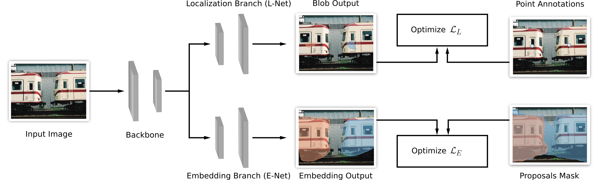

[](https://opensource.org/licenses/Apache-2.0)

## WISE-Net: Proposal-Based Instance Segmentation With Point Supervision (ICIP2020)
#### WISE-Net is a Weakly Supervised Instance Segmentation Embedding Network that learns to perform segmentation by training on point-labels only. 

#### It uses an embedding network and a proposal generator to learn what objects look like.</h5>

[[Paper](https://ieeexplore.ieee.org/document/9190782)][[Slides](docs/1314.pdf)] 



### Install requirements
`pip install -r requirements.txt` 
This command installs the Haven-ai library which helps in managing the experiments.


## Train & Validate WISE-Net on Pascal

```
python trainval.py -e wisenet_pascal -sb <savedir_base> -d <datadir> -r 1
```
where `<datadir>` is where the data is saved (example `.tmp/data`), and  `<savedir_base>` is where the results will be saved (example `.tmp/results`)


## Citation

```
@inproceedings{laradji2020proposal,
  title={Proposal-Based Instance Segmentation With Point Supervision},
  author={Laradji, Issam H and Rostamzadeh, Negar and Pinheiro, Pedro O and Vazquez, David and Schmidt, Mark},
  booktitle={2020 IEEE International Conference on Image Processing (ICIP)},
  pages={2126--2130},
  year={2020},
  organization={IEEE}
}
```
